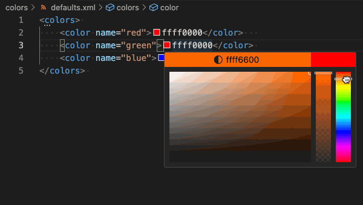

# Kodi Skin Tools

A set of tools to help in the development of [Kodi](http://kodi.tv/) skins.

# Features

## Skin reloading

Reload Kodi's skin to view the latest changes when ever a file is saved in the editor. A comma seperated list of extensions can be set to control which files type trigger a reload.

Requires [script.vscode.reload](http://) for Kodi to be installed.

Requires remote http control to be active in Kodi with both a username and password set.

Kodi Settings -> Service -> Control
 - Allow remote control via HTTP -> ON
 - Allow remote control from applications on this system -> ON
 - Allow remote control from applications on other systems -> ON (if Kodi is accessed over a network)

## Localization

## Color selection
Edit colors directly in the editor window.

# Requirements

Skin reloading requires [script.vscode.reload](http://) for Kodi to be installed.

# Extension Settings

| Setting | Value | Description |
| --- | --- | --- |
| kodi-skin-tools.decoratorColor | AARRGGBB | Color of decorated localization text in the hex AARRGGBB format |
| kodi-skin-tools.operation | ID or $LOCALIZE[ID] | Initial localization will generate ID or $LOCALIZE[ID] |
| kodi-skin-tools.reloadExtensions | .xml, .po | Comma seperated list of file extension that will be reloaded |
