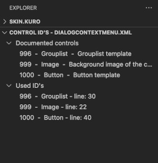
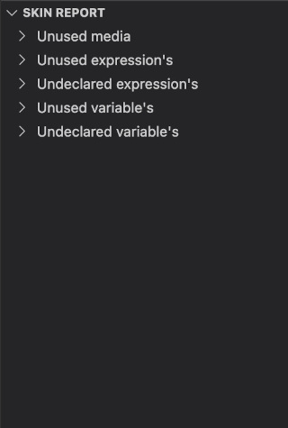

# Kodi Skin Tools

A set of tools to help in the development of [Kodi](http://kodi.tv/) skins.

# Features

## Skin reloading

Reload Kodi's skin to view the latest changes when ever a file is saved in the editor. A comma seperated list of extensions can be set to control which files type trigger a reload.

Requires [script.vscode.reload](https://github.com/roidy/script.vscode.reload/releases/download/v0.1.0/script.vscode.reload.zip) for Kodi to be installed.

Requires remote http control to be active in Kodi with both a username and password set.

Kodi Settings -> Service -> Control
 - Allow remote control via HTTP -> ON
 - Allow remote control from applications on this system -> ON
 - Allow remote control from applications on other systems -> ON (if Kodi is accessed over a network)

## Localization

Generate localization strings for any text in your skin.

Quickly switch between ID and $LOCALIZE[ID].

### Generate translation file

All Kodi string are generated in the en_gb language file by default. The `Generate translation file` command
can then be used to generate a new translation file in a different language ready to be externally translated. If the new translation file already exists then only new entries will be written into it to prevent overwriting already translated stings.

## Definition provider

Quickly jump to or Peek the definition of Expressions, Variables, Includes, Constants and Localized strings.

## Reference provider

Quickly find or Peek all references of Expressions, Variables, Includes, Constants and Localized strings.

## Color selection
Edit colors directly in the editor window.

# Editor views
## Control ID view
Show all the used control id's for the open xml document, and for known skin files look up which controls this xml should implement.

## Skin reports
Scan the skin and find any unused media files.

# Requirements

Skin reloading requires [script.vscode.reload](https://github.com/roidy/script.vscode.reload/releases/download/v0.1.0/script.vscode.reload.zip) for Kodi to be installed.

# Extension Settings

| Setting | Value | Description |
| --- | --- | --- |
| kodi-skin-tools.ipAddress | 127.0.0.1 | IP Address of you Kodi instance |
| kodi-skin-tools.port | 8080 | HTTP port of you Kodi instance |
| kodi-skin-tools.userName | string | UserName to control your Kodi instance |
| kodi-skin-tools.password | string | Password to control your Kodi instance |
| kodi-skin-tools.decoratorColor | AARRGGBB | Color of decorated localization text in the hex AARRGGBB format |
| kodi-skin-tools.operation | ID or $LOCALIZE[ID] | Initial localization will generate ID or $LOCALIZE[ID] |
| kodi-skin-tools.reloadExtensions | .xml, .po | Comma seperated list of file extension that will be reloaded |
| kodi-skin-tools.mediaExcludeGlob | glob | A glob pattern of directories to exclude from media scans |
| kodi-skin-tools.mediaExcludeKeywords| string | Comma separated list of words. If a media file name contains the keyword it will not be scanned. |
